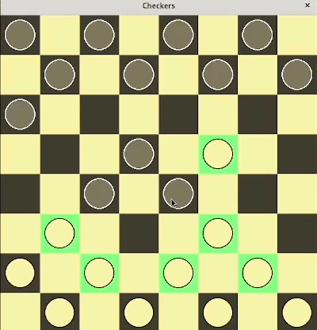

# Italian Checkers Viewer

Educational project written in Python (3.13.2) with the main programming patterns:
- type hint
- object structure (inheritance)
- interface
- protocol
- factory
- dependency injection
- list comprehension
- slice assignment
- generator expressions
- context manager
- event-driven programming
- threading
The libraries used to create the execution environment are in requirements.txt.

It implements a desktop viewer for checkers games (Italian Federdama rules) with moves
assisted by highlighting cells on the board.

The application can be launched in the following modes ('mode' option):
- 'play' to perform moves with real players ('player' engine) or
virtual players ('classic'/'SL'/'RL' engine, but only in future updates)
- 'view' to view moves from games read from external resources (.db/.pdn)
- 'scan' to quickly scan all games of a resource without graphics,
useful for testing or importing
- 'data' to launch an interactive console with automatic query generation
to explore local database data
In the main folder, there are some configuration files (.ini) as demos.

The project structure includes:

1) Engine (main thread)
Some classes formalize the basic concepts (Cells, Pieces, Move, State).
Others implement the rules of checkers (Score, MoveRules, MovesPlayer).
From the state of the board, all possible moves are examined according to the rules of the game, assigning them a score. Only one move among those with the highest score can be
executed, highlighting for each step of the move the cells to which it is possible to move (stored in a tree structure with the Node base class).
Checkerboard is the main class of the engine that orchestrates all the others.
During execution, the console prints various information about the application's state.

Communication between threads occurs through the formalization of channels, implemented with protocols that define a set of messages sent (sender) and received (receiver) on shared queues.

2) Graphics (secondary thread)
Currently, the board graphics are implemented with pygame.
It uses multilayer blending for cell highlighting, constraints for piece movement,
and mouse filtering with configurable timeouts for each movement phase
('timeout_selected', 'timeout_destinated', and 'timeout_validated' options).
All application features can be controlled with the mouse and/or keyboard.

In 'play' mode:
- K_TAB or cursor over selectable cell
allows selection of selectable cells.
- K_RETURN or left button held on the selected cell
activates the selected cell when moved.
- K_1, K_2, K_3, K_4 or mouse movement over the highlighted destination cells
to select the destination cell for the current step, taking the 4 Cartesian quadrants as reference from the starting cell.
- K_ESCAPE or left button release
validates the move if all possible steps are completed, or cancels the move.

In 'view' mode:
- K_SPACE or left-click on the keyboard
starts the move steps or resets the timer between one phase of piece movement and the next.
Also used to continue after the pause state.
If the game ends, it allows you to continue to the next one.
- K_PAUSE or right-click on the keyboard
enters the pause state, temporarily pausing the game.
- KMOD_CAPS
allows the rapid succession of moves by resetting the timers between the movement phases
(equivalent to a continuous repetition of K_SPACE).
- K_BACKSPACE or right-click on the keyboard when in pause state
returns to the previous move (undo).

For both modes:
- ALT+X or close icon
to close the application
- ALT+S
to automatically save the board state in .json format (named using a datetime)
before closing the application.
This allows you to resume games (played or viewed) from where they were
interrupted ('restore' option).

3) Data
Manages external resources in PDN (Portable Drafts Notation) format and local databases with SQlite, through which you can configure game imports and/or exports.
An interactive reader with automatic query generation allows you to explore the data contained in the databases, with results printed to the console and/or file (/log folder).
The /pdn folder contains an archive of Italian championship matches (Federdama).

Link:

- https://www.federdama.org/
- https://www.federdama.org/cms/index.php/federazione-1/statuti-e-regolamenti/regolamento-tecnico
- https://www.federdama.org/cms/index.php/servizi-1/download/pdn
